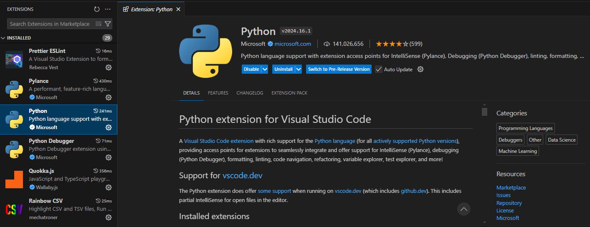
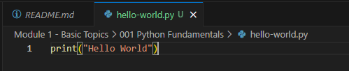
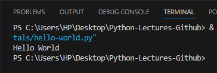

### 001: Python Fundamentals

#### Introduction to Python
Python is a versatile, high-level programming language known for its readability and simplicity. Created by **Guido van Rossum** and released in 1991, Python has become one of the most popular languages due to its clean syntax and wide range of applications. [Check this! Python is #1 in 2024](https://zerotomastery.io/blog/best-programming-languages-to-learn/). Whether you're a beginner or an experienced developer, Python is a great choice for building web applications, automating tasks, performing data analysis, and much more.


#### Use Cases in Today's World
Python's influence spans across various domains, but it has especially thrived in the world of **Artificial Intelligence (AI) and Machine Learning (ML)**. With the rise of *Generative AI—technologies like ChatGPT, DALL-E, and other text or image generation tools* — Python has been the go-to language. Its rich ecosystem of libraries like *TensorFlow, PyTorch, and OpenAI’s GPT APIs* allows developers to create intelligent systems that understand, generate, and interact with data in complex ways. From building chatbots to creating AI-driven art, Python is at the forefront of innovation in these fields. 

#### Why Python as Your First Language?
Python is often recommended as a beginner's first language, and for good reasons:
- **Readable Syntax**: Python code reads like English, making it easy to understand and write.
- **Strong Community Support**: There are countless resources, tutorials, and forums to help you along the way.
- **Versatility**: It’s used in web development, data science, automation, game development, and more.
- **Quick Feedback Loop**: Python's interpreted nature allows you to run code directly, see results, and make changes quickly—ideal for beginners to experiment and learn.

#### Tools We’ll Use in Module - 1
Before we dive into coding, let’s set up the environment needed to write and run Python code:

1. **Installing Python**:
   - Visit the [official Python website](https://www.python.org/) and download the latest version of Python.
   - Make sure to check the "Add Python to PATH" option during installation for easier command line use.

2. **Installing VS Code**:
   - Download Visual Studio Code (VS Code) from [here](https://code.visualstudio.com/).
   - VS Code is a popular text editor with features that make coding more efficient, like syntax highlighting and extensions for various programming languages.

3. **Installing the Python Extension in VS Code**:
   - Open VS Code, go to the Extensions panel (Ctrl+Shift+X), and search for "Python."
   - Install the Python extension provided by Microsoft for features like IntelliSense, linting, and debugging.



#### Running Your First Python Program: Hello World
Now that we have everything set up, let's run our first program:

1. Open VS Code and create a new file named `hello.py`.
2. Type the following code:
   ```python
   print("Hello, World!")
   ```
   
   
3. Save the file, and then run it by opening the terminal in VS Code (View > Terminal) and typing:
   ```bash
   python hello.py
   ```
   You should see `Hello, World!` displayed in the terminal.

   

   Alternatively, you can simply run the code (f5) and see the result in the terminal.
   **NOTE: This repo assumes you have installed Python and Python Extension in VS Code.**

**Explanation**: The `print()` function in Python is used to display text or output in the terminal. Here, it’s printing the classic "Hello, World!"—a tradition that signifies the start of your programming journey.

#### What’s Next?
Now that you’ve set up Python and run your first program, you're ready to dive deeper. In the next section, we’ll explore **Variables and Data Types**—the building blocks of any Python program. Understanding how to store and manipulate data is key to writing more complex and powerful programs. Let’s continue the journey!

[](https://github.com/wasiqs-classics/Python-Lectures-Github/tree/master/Module%201%20-%20Basic%20Topics)       [](https://github.com/wasiqs-classics/Python-Lectures-Github/tree/master/Module%201%20-%20Basic%20Topics/002%20Variables%20and%20Data%20Types)
---
